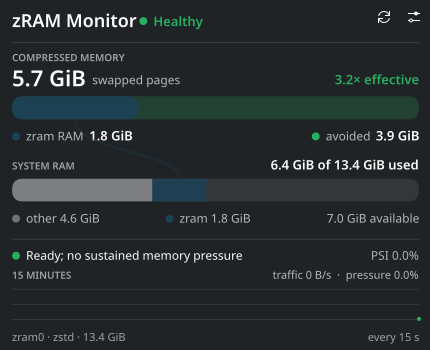
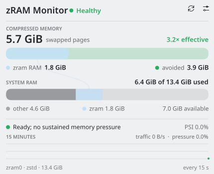

<!-- SPDX-License-Identifier: GPL-3.0-or-later -->

# zRAM Monitor

[](https://store.kde.org/p/2370040)

zRAM Monitor is a lightweight Plasma 6 widget that explains what Linux zram is doing, not merely how full it is. Its connected memory map shows the uncompressed pages held in zram, their physical RAM cost, the RAM avoided through compression, total system-memory use, swap traffic, and Linux memory pressure.

| Breeze Dark | Breeze Light |
| --- | --- |
|  |  |

## Features

- One compact graphical view instead of separate summary and dashboard screens.
- Effective compression ratio and physical RAM savings.
- Correct accounting: zram's physical cost is shown inside system RAM use, not added to it.
- Fifteen minutes of zram I/O and Linux PSI memory-pressure history.
- Theme-aware panel icon, text, accents, and health-state colors.
- Optional sustained-pressure notification.
- Configurable 1–30 second sampling interval.

## Requirements

- KDE Plasma 6
- Linux with an active zram swap device
- Plasma 5 Support QML module, used by Plasma's executable data source

## Install

Install zRAM Monitor from the [KDE Store](https://store.kde.org/p/2370040) through Plasma's widget picker, or download the `.plasmoid` file from the latest GitHub release and run:

```sh
kpackagetool6 --type Plasma/Applet --install ./quest.entropy.zrammonitor-VERSION.plasmoid
```

For a later upgrade, replace `--install` with `--upgrade`. Add **zRAM Monitor** from Plasma's widget picker after installation.

## Understanding the display

“Swapped pages” is the logical, uncompressed amount stored in zram. “zram RAM” is what those pages physically occupy after compression and allocator overhead. The system RAM-used figure already includes that physical cost.

An alert requires both elevated PSI memory pressure and active zram traffic. A well-compressing, heavily used zram device is not considered unhealthy merely because it contains a lot of data.

## Privacy and permissions

The bundled helper performs read-only sampling of `/sys/block/zram*`, `/proc/swaps`, `/proc/meminfo`, and, when available, `/proc/pressure/memory`. It requires neither elevated privileges nor network access.

## Development

```sh
make check
make package
```

`make check` runs repository, helper, package, shell, and QML validation. Release archives are written to `dist/`. See [CONTRIBUTING.md](CONTRIBUTING.md) and [PUBLISHING.md](PUBLISHING.md) for the complete workflows.

## License

GPL-3.0-or-later. See [LICENSES/GPL-3.0-or-later.txt](LICENSES/GPL-3.0-or-later.txt).
